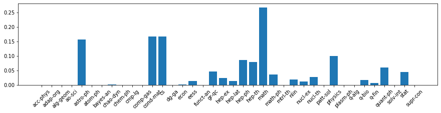
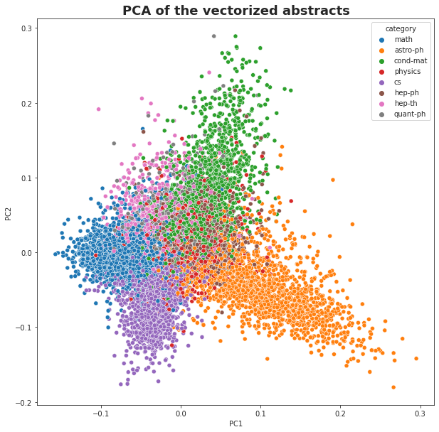
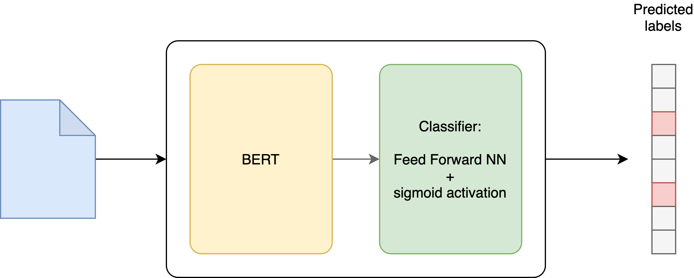

# Multi-label text classification using BERT

In this project I use pretrained BERT from Hugging Face to classify scientific papers into different categories based on their title and abstract.

A classical task in document management is document classification.
What if paper can have multiple topics associated with it ? I am building a recommender sysytem of categories for a paper based on its title and abstract.

As such, this could be framed as a multi label classification problem. Given an abstract what topics/tags can we confidentially assign to it without human intervention.

I add classification an additional layer to the pretrained BERT from Transformers library by Hugging Face.

- Data preprocessing 
- Preprocess text data for BERT
- Build PyTorch Dataset (tokenization, attention mask and padding)
- Use transfer learning to build Multi-label Text Classifier (MLTC) using the Transformers library by Hugging Face
- Fine tune the model
- Evaluate the model on test data
- Predict topic of an article based on the title and/or abstract

## Raw data preprocessing

In this project I use [arXiv](https://arxiv.org/about) dataset and metadata of more than 1.7 million scholarly articles in the fields of physics, mathematics, computer science, quantitative biology, quantitative finance, statistics, electrical engineering and systems science, and economics. 

The data is freely available and, for instance, can be obtained [here](https://www.kaggle.com/Cornell-University/arxiv/version/6?select=arxiv-metadata-oai-snapshot-2020-08-14.json). I use `arxiv-metadata-oai-snapshot-2020-08-14.json` metadata json file (2.8GB) which contains all the meta information about the article, including "title", "abstract", and "categories".   

Here is an example 

```
{"id":"0704.0001",
"submitter":"Pavel Nadolsky",
"authors":"C. Bal\\'azs, E. L. Berger, P. M. Nadolsky, C.-P. Yuan",
"title":"Calculation of prompt diphoton production cross sections at Tevatron and\n  LHC energies",
"comments":"37 pages, 15 figures; published version",
"journal-ref":"Phys.Rev.D76:013009,2007","doi":"10.1103/PhysRevD.76.013009",
"report-no":"ANL-HEP-PR-07-12",
"categories":"hep-ph",
"license":null,
"abstract":"  A fully differential calculation in perturbative quantum chromodynamics is\npresented for the production of massive photon pairs at hadron colliders. All\nnext-to-leading order perturbative contributions from quark-antiquark,\ngluon-(anti)quark, and gluon-gluon subprocesses are included, as well as\nall-orders resummation of initial-state gluon radiation valid at\nnext-to-next-to-leading logarithmic accuracy. The region of phase space is\nspecified in which the calculation is most reliable. Good agreement is\ndemonstrated with data from the Fermilab Tevatron, and predictions are made for\nmore detailed tests with CDF and DO data. Predictions are shown for\ndistributions of diphoton pairs produced at the energy of the Large Hadron\nCollider (LHC). Distributions of the diphoton pairs from the decay of a Higgs\nboson are contrasted with those produced from QCD processes at the LHC, showing\nthat enhanced sensitivity to the signal can be obtained with judicious\nselection of events.\n",
"versions":[
	{"version":"v1",
	"created":"Mon, 2 Apr 2007 19:18:42 GMT"},
	{"version":"v2",
	"created":"Tue, 24 Jul 2007 20:10:27 GMT"}],
"update_date":"2008-11-26",
"authors_parsed":[
	["Bal\u00e1zs","C.",""],
	["Berger","E. L.",""],
	["Nadolsky","P. M.",""],
	["Yuan","C. -P.",""]]}
```
The data is parsed, preprocessed and filtered in this notebook `notebooks/data-preparation.ipynb`. Some of the categories such as `acc-phys`, `econ` are underrepresented in the arXiv, I will exclude the categories with very low frequencies to simplify the task (this is a proof of concept project).


After the filtering end encoding only 8 most popular categories are present in the final dataset that we will use.
The PCA analysis of the most popular categories confirms the presence of the signal of the dataset (see the notebook).
<p align="center">

</p>

Note that the PCA is performed using articles with a single label across the topics to get a clear signal.

## Hugging Face Transformer for text classification

The model that I am goung to use for the multi-abel text classification is relying on the pretrained [BERT model from Hugging Face](https://huggingface.co/transformers/model_doc/bert.html). We fine-tune the pretrained BERT model with one additional output layer that handles the labeling task.
<p align="center">

</p>


